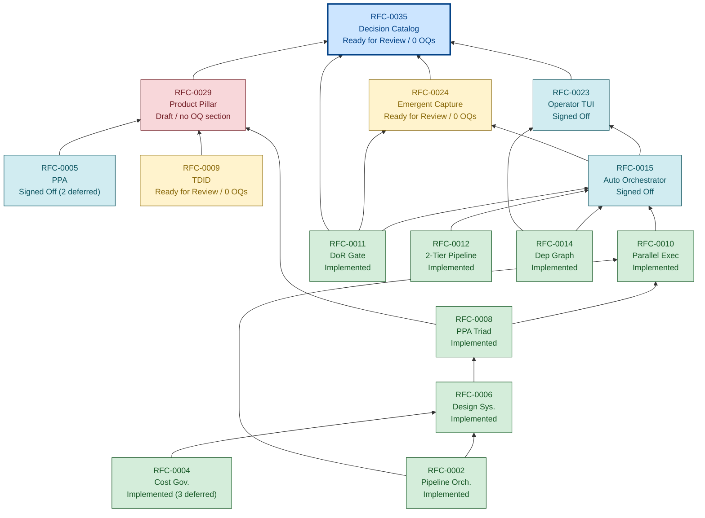

# AI-SDLC RFC Process

This document describes the RFC (Request for Comments) process for proposing changes to the AI-SDLC Framework specification. The process is modeled on Kubernetes KEPs (Kubernetes Enhancement Proposals) and OpenTelemetry OTEPs.

## What Requires an RFC

An RFC is required for:

- Adding, removing, or modifying a core resource type
- Adding or removing required fields from any resource schema
- Changing the semantics of existing normative requirements
- Adding a new interface contract to the adapter layer
- Adding or modifying enforcement levels
- Changing the autonomy level framework
- Adding a new conformance level
- Any change that could break backward compatibility

An RFC is **not** required for:

- Editorial fixes (typos, formatting, clarifications that do not change meaning)
- Adding optional fields to existing resource schemas
- Adding new enum values to existing fields
- Adding informative content to non-normative documents
- Updating examples or glossary entries

## Addendums — DEPRECATED (create a new RFC instead)

**Do not add new Addendums (Addendum A, Addendum B, etc.) to existing RFCs.** Create a new RFC.

### Why

Historically, several RFCs (RFC-0006, RFC-0007, RFC-0008, RFC-0009) used an "Addendum A / Addendum B / ..." pattern to extend a signed-off RFC with significant additional content. Operator review of this pattern (2026-05-04) found:

- **Review structure suffers** — an Addendum re-opens a signed-off RFC for review of just the new section, but the diff/PR surface conflates "the new content" with "minor edits to the original." Reviewers can't easily separate "I'm endorsing the addition" from "I'm re-endorsing the whole thing."
- **Sign-off semantics get muddy** — does signing the Addendum re-sign the whole RFC? Different RFCs answered this differently; there's no consistent contract.
- **Cross-references break** — `RFC-0008 §A.5` is harder to cite + maintain than `RFC-0029` (a hypothetical separate RFC). Internal links in tooling have to handle both `#section-id` and `#addendum-a-section-id` patterns.
- **RFCs become unbounded** — an Addendum-bearing RFC has no natural "this is done" point; it accretes addendums indefinitely. Separate RFCs are bounded artifacts that can ship + sign-off independently.
- **Lifecycle drift** — the parent RFC's `lifecycle: Signed Off` is technically correct for the original content but misleading for the Addendum (which may still be Draft). Separate RFCs maintain accurate lifecycle per artifact.

### What to do instead

When you'd be tempted to add an Addendum:

1. **Reserve a new RFC number** in the [Registry](#registry) with `Status: Reserved` + a one-line description of what the new content covers
2. **Draft the new RFC** with `requires: [<parent-rfc-id>]` in its frontmatter — the dependency is explicit
3. **Reference the parent** in §1 Summary: "This RFC extends RFC-NNNN with..."
4. **Open a separate PR** for the new RFC — independent review, independent sign-off, independent lifecycle
5. **The parent stays signed-off** — no re-opening required

### Historical Addendums (preserved as-is)

The Addendums in RFC-0006 (Addendum A + B), RFC-0007 (cross-references RFC-0006 Addendum A), RFC-0008 (Addendum A + B), and RFC-0009 (RFC-0008 Addendum A reference) are **kept** — they are signed-off normative content. The deprecation applies to NEW addendum creation only.

If a historical Addendum needs revision, prefer to carve it out to its own RFC at that revision pass (operator decision; not required).

## RFC Lifecycle (AISDLC-118)

The `lifecycle` frontmatter field captures the per-owner sign-off + implementation arc:

```
Draft → Ready for Review → Signed Off → Implemented
                                              │
                                              └─→ Superseded (terminal)
```

| Lifecycle | Meaning | Sign-off state |
|---|---|---|
| **Draft** | Initial brainstorm; structure may shift | Sign-off boxes empty |
| **Ready for Review** | Structure stable; ready for owner sign-off | At least one owner signed; awaiting others |
| **Signed Off** | All owners signed; design locked | All owner boxes checked |
| **Implemented** | Corresponding milestone reached Done | n/a (post-sign-off state) |
| **Superseded** | Replaced by newer RFC | Header notes the successor |

**Drafts MUST land on main early.** As soon as the author considers the RFC shareable (typically after the first internal pass), it should be merged to main with `lifecycle: Draft`. Stakeholders can then reference it at its canonical `spec/rfcs/RFC-NNNN-*.md` URL while iteration continues through normal PR review. **Sign-off no longer gates visibility** — these are orthogonal questions. Hiding drafts until sign-off destroys the feedback loop the RFC process is supposed to create.

The `lifecycle` field is separate from the per-owner sign-off checklist that lives in the RFC body (`## Sign-Off`). The checklist is the source of truth for which individual owners have signed; `lifecycle` is the aggregate state used by the index table and tooling.

### Legacy `status` field

The original `status` enum (Draft / Under Review / Approved / Implemented / Final / Rejected / Withdrawn) is retained for back-compat with `scripts/check-rfc-docs.mjs`, which uses it to decide when to enforce the `requiresDocs` gate. New RFCs SHOULD set both fields. Mapping guide:

| `lifecycle` | Recommended `status` |
|---|---|
| `Draft` | `Draft` |
| `Ready for Review` | `Draft` (use legacy `Under Review` only if you want the WG-review semantics) |
| `Signed Off` | `Approved` (or `Final` for sign-off-gated RFCs whose reference impl is still in flight) |
| `Implemented` | `Implemented` (or `Final` retained from the pre-AISDLC-118 convention) |
| `Superseded` | `Withdrawn` (and link the successor in the body) |

## Legacy RFC Lifecycle (pre-AISDLC-118)

The flow below describes the original Kubernetes-KEP-style process. AISDLC-118 reframes the visibility question (drafts on main early) but the per-stage activity descriptions still apply.

```
Draft → Discussion → WG Review → PoC → Approval → Spec Update
```

### 1. Draft

The author creates a new RFC by copying `RFC-0001-template.md` to `RFC-NNNN-title.md` (where NNNN is the next available number) and fills in all sections. The author submits the RFC as a pull request.

**Status:** `Draft`

### 2. Discussion

Community members review and discuss the RFC via PR comments. The author addresses feedback and updates the RFC. Discussion should run for at least 7 days.

**Status:** `Under Review`

### 3. Working Group Review

The relevant SIG (Special Interest Group) reviews the RFC for design soundness:

- **sig-spec** — Changes to core resource types, resource model, or reconciliation semantics
- **sig-adapters** — Changes to adapter interfaces, registration, or discovery
- **sig-security** — Changes to autonomy levels, policy enforcement, or security model

The SIG provides a recommendation (approve, request changes, or reject).

**Status:** `Under Review`

### 4. Proof of Concept

For substantive changes, the author demonstrates feasibility with a proof-of-concept implementation. The PoC may be a PR to the reference implementation repository showing the proposed change works as described.

**Status:** `Under Review`

### 5. Approval

The RFC requires:

- Two maintainer approvals
- A 7-day final comment period after the last substantive change
- SIG recommendation of approval

**Status:** `Approved`

### 6. Spec Update

After approval, the spec is updated to incorporate the RFC. The RFC status is updated to reflect the outcome.

**Status:** `Implemented`

## RFC Status Values

| Status         | Description                                                                                                                                                                   |
| -------------- | ----------------------------------------------------------------------------------------------------------------------------------------------------------------------------- |
| `Draft`        | RFC is being written by the author                                                                                                                                            |
| `Under Review` | RFC is open for community discussion and SIG review                                                                                                                           |
| `Approved`     | RFC has been approved; spec update pending                                                                                                                                    |
| `Implemented`  | RFC has been merged into the specification                                                                                                                                    |
| `Final`        | Terminal pre-implementation status for sign-off-gated RFCs (RFC-0006, RFC-0008): the spec is locked but reference implementation work continues. Promotes to `Implemented` when the normative spec documents land. |
| `Rejected`     | RFC was reviewed and rejected                                                                                                                                                 |
| `Withdrawn`    | RFC was withdrawn by the author                                                                                                                                               |

## YAML Frontmatter Convention

Every RFC under `spec/rfcs/` MUST begin with a YAML frontmatter block (delimited by `---` on its own line, like Jekyll/Hugo posts). The frontmatter is the source of truth for tooling — CI workflows, dashboards, and the index table below all read it. The visible bold-status block in the RFC body (`**Status:** Draft`, etc.) is preserved for human readability but is informational only.

The schema lives at [`spec/schemas/rfc.schema.json`](../schemas/rfc.schema.json) and is the authoritative definition of allowed field names and values.

### Required fields

| Field          | Type            | Notes                                                                                                                                          |
| -------------- | --------------- | ---------------------------------------------------------------------------------------------------------------------------------------------- |
| `id`           | string          | Canonical identifier matching the filename prefix (`RFC-NNNN`).                                                                                |
| `title`        | string          | Human-readable title (no `RFC-NNNN:` prefix — that's encoded in `id`).                                                                          |
| `status`       | enum            | One of the RFC Status Values above.                                                                                                            |
| `author`       | string          | Primary author name(s). Comma-separated for multi-author RFCs.                                                                                  |
| `created`      | ISO 8601 date   | When the RFC was first authored.                                                                                                                |
| `updated`      | ISO 8601 date   | Most recent substantive update.                                                                                                                 |
| `requiresDocs` | array of enum   | Closed enum declaring which user-facing doc surfaces must reference this RFC. See "requiresDocs values" below. `[]` is valid for purely strategic RFCs. |

### Optional fields

| Field                  | Type           | Notes                                                                                                                                                  |
| ---------------------- | -------------- | ------------------------------------------------------------------------------------------------------------------------------------------------------ |
| `targetSpecVersion`    | string         | Spec API version targeted (e.g. `v1alpha1`). Recommended.                                                                                              |
| `requires`             | array of RFC ID | RFCs this RFC depends on (e.g. RFC-0006 requires RFC-0002 and RFC-0004).                                                                              |
| `amends`               | array of RFC ID | RFCs this RFC amends (e.g. RFC-0010 amends RFC-0002).                                                                                                  |
| `deferredDocs`         | boolean        | Escape hatch — see below.                                                                                                                              |
| `deferredDocsDeadline` | ISO 8601 date   | Required when `deferredDocs: true`.                                                                                                                    |

### `requiresDocs` values

The closed enum is captured in the JSON schema. Each value maps to a `docs/` subdirectory:

| Value              | Maps to              | Use when…                                                                                                |
| ------------------ | -------------------- | -------------------------------------------------------------------------------------------------------- |
| `tutorial`         | `docs/tutorials/`    | A walkthrough is needed to teach the new capability.                                                     |
| `operator-runbook` | `docs/operations/`   | Operators (anyone running the orchestrator in production) need a how-to-operate guide.                  |
| `api-reference`    | `docs/api-reference/` | The RFC introduces or changes a programmatic surface (TypeScript types, schemas, runtime APIs).         |
| `getting-started`  | `docs/getting-started/` | The RFC affects the first-run path / onboarding.                                                      |
| `example`          | `docs/examples/`     | A worked example file (config, code, transcript) is needed to show real usage.                          |

For each value listed in an RFC's `requiresDocs`, **at least one file** in the corresponding subdirectory MUST reference the RFC by its `id` (literal text, e.g. `RFC-0006`). The CI script in AISDLC-69.3 enforces this; AISDLC-69.2 (this PR) defines the convention.

### Deferred docs escape hatch

Some RFCs are sign-off-finalised before the matching docs can reasonably be authored — for example, when the spec is locked but the reference implementation is still in flight. For those:

```yaml
requiresDocs:
  - tutorial
  - operator-runbook
deferredDocs: true
deferredDocsDeadline: 2026-06-30
```

CI passes but logs a warning that grows louder as the deadline approaches. Hard enforcement of the deadline is intentionally deferred to a future task — for now this is a forcing function, not a gate.

### Operator process — when authoring an RFC

1. Copy `RFC-0001-template.md` and fill in the YAML frontmatter at the top.
2. Pick the `status` value that matches your phase (`Draft` for new work) AND set the `lifecycle` field (also `Draft` for new work — see the [RFC Lifecycle (AISDLC-118)](#rfc-lifecycle-aisdlc-118) section above).
3. Decide which doc surfaces the RFC needs by walking through the `requiresDocs` enum. Pick the smallest set that covers the user-visible impact — empty (`[]`) is acceptable and correct for purely strategic / conceptual RFCs (e.g. RFC-0013 product strategy).
4. **Land the draft on main early.** As soon as the structure is shareable (typically after the first internal pass), open a PR that merges the RFC to main with `lifecycle: Draft`. Stakeholders can then reference it at the canonical `spec/rfcs/RFC-NNNN-*.md` URL while you iterate. Sign-off no longer gates visibility.
5. As the design matures, flip `lifecycle` through the states (Draft → Ready for Review → Signed Off → Implemented) via subsequent PRs that update the frontmatter alongside the per-owner sign-off checklist in the body.
6. **Before requesting `Approved` status**, ensure each surface in `requiresDocs` has at least one doc file referencing the RFC by its `id`. If the docs aren't ready, set `deferredDocs: true` with a deadline AND file a backlog task for the gap (so the orchestrator can eventually pick it up).
7. When the spec lands and the docs exist, flip `status` to `Implemented` (or `Final` for sign-off-gated RFCs), set `lifecycle: Implemented`, and remove `deferredDocs` if it was set.

## File Naming

RFC files follow the pattern:

```
RFC-NNNN-short-title.md
```

- `NNNN` is a zero-padded sequential number
- `short-title` is a lowercase, hyphenated summary (e.g., `custom-resource-types`)

## Claiming an RFC number (AISDLC-165)

Numbers are allocated **sequentially**. The single source of truth is the [Registry](#registry) table below — if your number isn't in the registry, you do not own it. To claim a number, you must EITHER:

1. **Open a PR** that adds your RFC file at `spec/rfcs/RFC-NNNN-<slug>.md` AND adds the registry row pointing to your filename, OR
2. **Reserve** by opening a PR that just adds a registry row marked `Status: Reserved` / `Lifecycle: Placeholder` with a one-line description in the Notes column of what you intend to write. Reserved entries hold the number while the design matures; promote to a real entry by amending the row when the file lands.

To pick the next available number: scan the registry, take the highest number, add 1. If two PRs claim the same number simultaneously, the one that lands first wins; the loser must rename. Reserved numbers may be released back to the pool by removing the row (or marking `Status: Released` and garbage-collecting later).

The registry covers four states:

- **Active** — the RFC file exists and is in some lifecycle phase (Draft / Ready for Review / Signed Off / Implemented).
- **Reserved** — number is held; no file yet. Notes column explains the intended scope.
- **Withdrawn** — number was claimed but the work was folded into another RFC or abandoned. The number is NOT recycled (slot collisions are confusing — see RFC-0003 / RFC-0013 history).
- **Template** — RFC-0001 only.

## Registry

The `OQs` column reports **unresolved open questions** per RFC. Source-of-truth is the RFC body's Open Questions section (typically §13 / §14 / §15). `0` means all OQs are resolved; `—` means the RFC has no OQ section (template, reserved-without-file, or non-normative strategic RFC). For the per-RFC OQ breakdown see [Open Questions Inventory](#open-questions-inventory); for the dependency graph rooted at RFC-0035 see [Critical Path to RFC-0035](#critical-path-to-rfc-0035-decision-catalog).

| #    | Title                                                                                                | Status      | Lifecycle    | OQs | Author                                                       | File                                                                              | Notes                                                                                                       |
| ---- | ---------------------------------------------------------------------------------------------------- | ----------- | ------------ | --- | ------------------------------------------------------------ | --------------------------------------------------------------------------------- | ----------------------------------------------------------------------------------------------------------- |
| 0001 | Template                                                                                             | n/a         | Template     | —   | —                                                            | [RFC-0001-template.md](RFC-0001-template.md)                                      | Skeleton for new RFCs; not normative.                                                                       |
| 0002 | Pipeline Orchestration Policy                                                                        | Implemented | Implemented  | 1   | AI-SDLC Contributors                                         | [RFC-0002-pipeline-orchestration.md](RFC-0002-pipeline-orchestration.md)          | requiresDocs: tutorial, api-reference, example. Retrofit 2026-05-13 — design locked; OQ-3 `onTimeout: escalate` runtime not wired (RFC-0015 PR-labeling is the de-facto path). |
| 0003 | Infrastructure Provider Adapters                                                                     | Implemented | Implemented  | 0   | AI-SDLC Contributors                                         | [RFC-0003-infrastructure-adapters.md](RFC-0003-infrastructure-adapters.md)        | Slot collision resolved in AISDLC-109 (product-strategy renumbered to RFC-0013). Retrofit 2026-05-13 — all 3 OQs resolved (no transactions, no ack, no versioning); RFC-0010 §13 `HarnessAdapter` is orthogonal, not superseding. |
| 0004 | Cost Governance and Attribution                                                                      | Implemented | Implemented  | 3   | AI-SDLC Contributors                                         | [RFC-0004-cost-governance-and-attribution.md](RFC-0004-cost-governance-and-attribution.md) | requiresDocs: tutorial, api-reference, operator-runbook. Retrofit 2026-05-13 — CostPolicy / CostReconciler / CostTracker shipped end-to-end; 3 OQs deferred (humanReviewCost compute, cross-provider normalization, infra cost allocation). RFC-0032 extends, does not supersede. |
| 0005 | Product Priority Algorithm (PPA)                                                                     | Approved    | Signed Off   | 2   | Alexander Kline (Arcana Concept Studio), AI-SDLC Contributors | [RFC-0005-product-priority-algorithm.md](RFC-0005-product-priority-algorithm.md)  | requiresDocs: api-reference, operator-runbook. Retrofit 2026-05-13 — design locked; admission subset wired (`orchestrator/src/admission-composite.ts`, `sa-scoring/`); full runtime composite deferred to PPA v1.1 per RFC-0008 §17. 2 OQs deferred (lifecycle weights for non-Eρ₄ dimensions, calibration retention). |
| 0006 | Design System Governance Pipeline                                                                    | Final       | Implemented  | 1   | Dominique Legault, Morgan Hirtle, Alexander Kline             | [RFC-0006-design-system-governance-v5-final.md](RFC-0006-design-system-governance-v5-final.md) | requiresDocs: tutorial, operator-runbook, api-reference. Design locked; OQ-7 tooling-decision portion remains. |
| 0007 | Figma Make Pipeline Integration                                                                      | Final       | Signed Off   | 5   | Dominique Legault, Morgan Hirtle, Alexander Kline             | [RFC-0007-figma-make-pipeline-integration-v1-final.md](RFC-0007-figma-make-pipeline-integration-v1-final.md) | requires RFC-0002, RFC-0004, RFC-0006. Design locked; 5 OQs framed as implementation-refinement items.        |
| 0008 | PPA Triad Integration                                                                                | Final       | Implemented  | 0   | Dominique Legault, Morgan Hirtle, Alexander Kline             | [RFC-0008-ppa-triad-integration-final-combined.md](RFC-0008-ppa-triad-integration-final-combined.md) | requiresDocs: api-reference, operator-runbook                                                               |
| 0009 | Tessellated Design Intent Documents                                                                  | Draft       | Ready for Review | 0 | Alexander Kline                                              | [RFC-0009-tessellated-design-intent-documents.md](RFC-0009-tessellated-design-intent-documents.md) | v3.4 (2026-05-04) resolves all 13 OQs; OQ-3 + OQ-7 carve out follow-on patterns reserved as RFC-0017, RFC-0018, RFC-0020, RFC-0021. Engineering ✅ + Design ✅ signed v3.4; Product v3.4 sign-off pending (Alex authored v3.2). |
| 0010 | Parallel Execution and Worktree Pooling                                                              | Draft       | Implemented  | 0   | Dominique Legault                                            | [RFC-0010-parallel-execution-worktree-pooling.md](RFC-0010-parallel-execution-worktree-pooling.md) | Legacy `status: Draft` retained; AISDLC-70.1–70.9 all Done. amends RFC-0002 + RFC-0004.                     |
| 0011 | Definition-of-Ready Gate for Pipeline Admission                                                      | Implemented | Implemented  | 1   | dominique@reliablegenius.io                                  | [RFC-0011-definition-of-ready-gate.md](RFC-0011-definition-of-ready-gate.md)      | requiresDocs: [] (phased rollout — docs land per phase). Lifecycle audit 2026-05-13 promoted Signed Off → Implemented: AISDLC-115 umbrella + all 9 phases 115.1–115.9 shipped; `evaluationMode: enforce` live in dogfood since 2026-05-03. Q10 cost confirmation is an implementation-tier residual deferred to Phase 2b. |
| 0012 | Two-Tier Pipeline Architecture with Shared Core Library                                              | Implemented | Implemented  | 4   | dominique@reliablegenius.io                                  | [RFC-0012-two-tier-pipeline-architecture.md](RFC-0012-two-tier-pipeline-architecture.md) | Internal architecture; no user-facing docs required. Lifecycle audit 2026-05-13 promoted Signed Off → Implemented per operator confirmation: pipeline-cli is the production runtime substrate; phase tasks AISDLC-100.{1,2,3,5,6,7,8} + Codex adaptation 202.{1-4} shipped; umbrella close-out lost in re-org but contract runs every `/ai-sdlc execute` today. Q5–Q8 remain as implementation-tier residuals. |
| 0013 | AI-SDLC Orchestrator — Product Strategy                                                              | Implemented | Implemented  | 0   | AI-SDLC Contributors                                         | [RFC-0013-product-first-implementation-strategy.md](RFC-0013-product-first-implementation-strategy.md) | Strategic / conceptual. Renumbered from former RFC-0003 collision (AISDLC-109). Retrofit 2026-05-13 — `@ai-sdlc/orchestrator` v0.10.0 ships the strategy; all 3 OQs resolved (Apache-2.0 confirmed, CostTracker + cost_ledger shipped, AAIF moot — project targets CNCF Sandbox per CHARTER.md). |
| 0014 | Dependency Graph Composition for Pipeline Decisions                                                  | Implemented | Implemented  | 0   | dominique@reliablegenius.io                                  | [RFC-0014-dependency-graph-composition.md](RFC-0014-dependency-graph-composition.md) | All 6 OQs resolved inline 2026-05-01. Lifecycle audit 2026-05-13 promoted Draft → Implemented: AISDLC-167 umbrella + all 5 phases 167.1–167.5 shipped; `AI_SDLC_DEPS_COMPOSITION` flag stays opt-in per operator decision 2026-05-10 (not an incomplete impl). |
| 0015 | Autonomous Pipeline Orchestrator                                                                     | Approved    | Signed Off   | 0   | dominique@reliablegenius.io                                  | [RFC-0015-autonomous-pipeline-orchestrator.md](RFC-0015-autonomous-pipeline-orchestrator.md) | requires RFC-0010, RFC-0011, RFC-0012, RFC-0014. All 12 OQs resolved 2026-05-01. Lifecycle audit 2026-05-13 promoted Ready for Review → Signed Off: AISDLC-169 umbrella + all 5 phases 169.1–169.5 shipped. Flag default-on promotion gated on AISDLC-253 fixture-leak fix + fresh corpus, not on implementation gap. |
| 0016 | Estimation Calibration with T-Shirt Sizes                                                            | Draft       | Ready for Review | 0 | dominique@reliablegenius.io                              | [RFC-0016-estimation-calibration-tshirt-sizes.md](RFC-0016-estimation-calibration-tshirt-sizes.md) | requires RFC-0011, RFC-0015. All 8 OQs resolved via operator walkthrough 2026-05-03 (documented in §15 Resolutions). |
| 0017 | In-Soul Variant Pattern                                                                              | Draft       | Draft        | 8   | Morgan Hirtle                                                | [RFC-0017-in-soul-variant-pattern.md](RFC-0017-in-soul-variant-pattern.md)        | Carved out of RFC-0009 per OQ-3. Variant = a soul-scoped sub-theme with distinct visual identity and audience specialization. Practitioner validation via InternalAdopter product suite (ProductA / ProductB / ProductC / ProductD as four souls on shared substrate). requires RFC-0009. |
| 0018 | In-Soul Journey Pattern                                                                              | Draft       | Draft        | 10  | Morgan Hirtle                                                | [RFC-0018-in-soul-journey-pattern.md](RFC-0018-in-soul-journey-pattern.md)        | Carved out of RFC-0009 per OQ-3. Journey = a temporally-ordered user flow within a soul that carries distinct design intent and completion criteria. Practitioner validation via InternalAdopter accessibility audit pipeline. requires RFC-0009, RFC-0017. |
| 0019 | Embedding Provider Adapter Framework                                                                 | Draft       | Draft        | 7   | dominique@reliablegenius.io                                  | [RFC-0019-embedding-provider-adapter.md](RFC-0019-embedding-provider-adapter.md)  | Adapter framework for text→vector embedding providers; OpenAI text-embedding-3-small ships as default; adopters can plug custom adapters per the harness-adapter pattern (RFC-0010 §13). |
| 0020 | Session-bug + Severity Scoring Rule                                                                  | Draft       | Draft        | —   | —                                                            | (none yet — reservation only; draft ships in follow-on PR)                        | Carved out of RFC-0009 §13.5 per OQ-7 reversal of Position-stated; Dπ₃ refinement with practitioner validation. |
| 0021 | Incident Monitoring + Root-Cause Analysis                                                            | Reserved    | Placeholder  | —   | —                                                            | (none yet)                                                                        | Carved out of RFC-0009 §13.6 per OQ-7 reversal of Position-stated; pending adopter incident data before normative spec. |
| 0022 | Compliance Posture + Audit Surface                                                                   | Draft       | Draft        | 7   | dominique@reliablegenius.io                                  | [RFC-0022-compliance-posture-audit-surface.md](RFC-0022-compliance-posture-audit-surface.md) | Adopter declares regulatory posture (HIPAA/SOC2/PCI-DSS/GDPR/etc.); framework derives gate defaults (DB pool isolation, secret-scan strictness, attestation requirement, retention) and exports audit evidence packs. RFC-0020 and RFC-0021 carved out of RFC-0009 (OQ-7); RFC-0009 OQ-11 trigger checklist references RFC-0022 as the canonical regime-declaration surface. |
| 0023 | Operator TUI — Pipeline Monitoring + Steering Surface                                                | Approved    | Signed Off   | 0   | dominique@reliablegenius.io                                  | [RFC-0023-operator-tui-pipeline-monitoring.md](RFC-0023-operator-tui-pipeline-monitoring.md) | requires RFC-0014, RFC-0015. Operator-facing terminal interface to monitor + unblock the autonomous pipeline. All 10 OQs resolved via operator walkthrough 2026-05-03. Lifecycle audit 2026-05-13 promoted Ready for Review → Signed Off: AISDLC-178 umbrella + all 7 phases 178.1–178.7 + extension 178.4.1 shipped. Flag default-on follows the same opt-in pattern as RFC-0014 / RFC-0015. |
| 0024 | Emergent Issue Capture + Triage Pattern                                                              | Draft       | Ready for Review | 0 | dominique@reliablegenius.io                                  | [RFC-0024-emergent-issue-capture-and-triage.md](RFC-0024-emergent-issue-capture-and-triage.md) | requires RFC-0011, RFC-0015. Sidecar mechanism for capturing findings mid-work + triage rubric + decision-deferred handoff. Addresses VISION.md §5 emergent-work gap. **Partial implementation 2026-05-13** — AISDLC-269 / PR #483 shipped `cli-capture` (§5.1-§5.4), `spec/schemas/capture-record.v1.schema.json`, `captures-pending.ts` filter against the 2026-05-13 first-pass OQ resolutions. **2026-05-15 walkthrough revised OQ-1/2/3/5/7/9/11 + added §15.1 Capture Lifecycle Defaults** — lifecycle rolled back from `Implemented` to `Ready for Review`. Gap closed by **RFC-0024 Refit (AISDLC-320 / 321 + 275-278)**; lifecycle flips back to `Implemented` after Refit Phase 6 (AISDLC-278) ships. |
| 0025 | Framework Quality Monitoring (Non-Decision Failure Modes)                                            | Draft       | Ready for Review | 0 | dominique@reliablegenius.io                                  | [RFC-0025-framework-quality-monitoring.md](RFC-0025-framework-quality-monitoring.md) | requires RFC-0015, RFC-0024. Distinguishes "operator under-decided" failures (fix the issue) from "framework misbehaved" failures (fix the framework); auto-routes the latter into bugfix backlog with severity scoring; closes the AISDLC-176-style "valid commit stranded" loop. Operationalizes VISION.md §4 honest failure modes. **OQ walkthrough complete 2026-05-15** — all 10 OQs resolved in §13 (confidence-bucketed classifier, multi-window recurrence, per-org-configurable suggest-only attribution, operator-initiated pre-filled GitHub issue for upstream reporting, capture-record-based coverage-gap response, composite blast-radius determinism sampling, first-capture MTTR, instrumented operator-time-cost, strict vendor-namespace enforcement). §13.1 codifies the per-org config schema. **Partial impl 2026-05-13** — `tui/analytics/quality-reader.ts` + 9 playbook handlers ship. **AISDLC-270 / PR #481 paused** — pre-walkthrough impl candidate; audit against the resolved OQs pending (AISDLC-300 sweep) before unblock/refit/rebuild decision. |
| 0026 | Exploration Workstream Pattern                                                                       | Draft       | Draft        | 12  | dominique@reliablegenius.io                                  | [RFC-0026-exploration-workstream-pattern.md](RFC-0026-exploration-workstream-pattern.md) | requires RFC-0011, RFC-0015, RFC-0024. First-class "spike/research" workstream type that bypasses DoR's decision-frontloading gate (since the goal IS to discover the unknowns); explicit time-box + handoff back to standard execution flow when knowns crystallize. Addresses VISION.md §5 exploration-mode gap. |
| 0027 | Design Coherence Drift Detection                                                                     | Reserved    | Placeholder  | —   | Morgan Hirtle                                                | (none yet)                                                                        | Design Authority sign-off condition C3 from RFC-0009. Defines DesignCoherenceDrift reconciliation event: fires when delta between soul's design.imperatives and what DSB/component catalog implements exceeds threshold. Fourth Eτ_tessellation_drift detection rule. requires RFC-0009, RFC-0006. |
| 0028 | Engineering-Axis Substrate Enforcement for Multi-Soul Platforms                                      | Draft       | Draft        | 4   | Alexander Kline                                              | [RFC-0028-engineering-axis-substrate-enforcement.md](RFC-0028-engineering-axis-substrate-enforcement.md) | requires RFC-0008, RFC-0009. Substrate Contract pattern: which fields are `core` (locked, identity-class) vs `evolving` (override-permitted) at substrate level for multi-soul platforms. |
| 0029 | Product Pillar — Architectural Vision (Design Principles, Framework Positions, Strategic Direction)  | Draft       | Draft        | —   | Alexander Kline                                              | [RFC-0029-product-pillar-architectural-vision.md](RFC-0029-product-pillar-architectural-vision.md) | requires RFC-0005, RFC-0008, RFC-0009. Strategic / vision RFC: Product pillar's positions on active RFCs (0014/0015/0016/0017/0018/0019/0022/0023/0024) + six design principles. No OQ section by design (vision doc; positions stated).             |
| 0030 | Signal Ingestion Pipeline (Demand Sources → D1)                                                      | Draft       | Draft        | 5   | Alexander Kline                                              | [RFC-0030-signal-ingestion-pipeline.md](RFC-0030-signal-ingestion-pipeline.md)    | requires RFC-0005, RFC-0008, RFC-0011, RFC-0029. Adapter framework for ingesting demand signals (interviews, tickets, telemetry, ICP cohort data) into PPA's D1 channel. Tier weighting + clustering + SA Resonance filtering. |
| 0031 | Calibration-Driven DID Revision Proposal Mechanism                                                   | Implemented | Implemented  | 0   | Alexander Kline                                              | [RFC-0031-calibration-driven-did-revision-proposal.md](RFC-0031-calibration-driven-did-revision-proposal.md) | requires RFC-0005, RFC-0008, RFC-0009, RFC-0029, RFC-0030. Closes calibration loop: framework auto-proposes DID revisions for operator review when calibration data shows consistent drift. Fully implemented in AISDLC-271 — `DIDRevisionProposal` event, healthy/unhealthy/ambiguous classification, approval routing, 14-day expiry, `lockNoProposal` opt-out, rejection learnings in `sa-scoring/revision-proposal.ts`. All 5 OQs resolved. |
| 0032 | Cost-Governance Seam (Continuous ER Cost Pressure + Burst Spend Mechanism)                           | Draft       | Draft        | 5   | Alexander Kline                                              | [RFC-0032-cost-governance-seam.md](RFC-0032-cost-governance-seam.md) | requires RFC-0004, RFC-0005, RFC-0008, RFC-0009, RFC-0010, RFC-0029. Adds continuous Eρ_cost pressure to PPA scoring + explicit burst-spend mechanism for high-priority work bypassing steady-state ceilings. |
| 0033 | Governance Reporting Layer (Periodic Synthesis of the Admission Chain)                               | Draft       | Draft        | 5   | Alexander Kline                                              | [RFC-0033-governance-reporting-layer.md](RFC-0033-governance-reporting-layer.md) | requires RFC-0005, RFC-0008, RFC-0011, RFC-0014, RFC-0015, RFC-0022, RFC-0029, RFC-0030. GovernanceReport resource: read-only periodic synthesis (scoring + cost + quality + calibration + R&D evidence sections). Composes with RFC-0022 audit packs. |
| 0034 | PR Merge Critical-Path Ordering                                                                      | Reserved    | Placeholder  | —   | dominique@reliablegenius.io                                  | (none yet — reservation only; AISDLC-178.4.1 ships the minimum derivation in RFC-0023 §7.2) | Longer-term home for auto-rebase trigger semantics, `depends-on` label conventions (canonical syntax + body-marker spec), and multi-repo PR ordering. AISDLC-178.4.1 reserved this number per its AC #8 (originally numbered RFC-0028 in the task spec; that slot was already taken by Engineering-Axis Substrate Enforcement, so this is the actual reservation). requires RFC-0014, RFC-0023. |
| 0035 | Decision Catalog and Operator Decision Routing                                                       | Draft       | Ready for Review | 0 | dominique@reliablegenius.io                              | [RFC-0035-decision-catalog-operator-routing.md](RFC-0035-decision-catalog-operator-routing.md) | requires RFC-0011, RFC-0023, RFC-0024, RFC-0029. Operationalizes VISION.md §3 (operator-as-decision-steward): event-sourced `Decision` resource + deterministic-first ladder + auto-apply-with-override-window + RFC-0014/0016 composition. **OQ walkthrough complete 2026-05-15** — all 14 OQs resolved per §15 Resolution markers; §15.1 codifies the 8 design patterns. Lifecycle promoted Draft → Ready for Review; awaits per-owner sign-off. |
| 0036 | Spec-Kit Bridge and Adopter Spec-Authoring Surface                                                   | Draft       | Draft        | 12  | dominique@reliablegenius.io                                  | [RFC-0036-spec-kit-bridge-adopter-authoring.md](RFC-0036-spec-kit-bridge-adopter-authoring.md) | requires RFC-0010, RFC-0011. Bridges [GitHub Spec Kit](https://github.com/github/spec-kit) (front-of-funnel artifact authoring) with ai-sdlc (back-of-funnel execution + governance). Defines the three-tier adopter authoring model (RFC → Spec → Task), the spec-kit import path (`ai-sdlc import-spec`), an optional adopter RFC scaffold (`ai-sdlc rfc init`), and the positioning updates that operationalize the AISDLC-248 repositioning. |

**Next available number:** RFC-0037.

> **Historical note (RFC-0003 collision):** Two different proposals (`-infrastructure-adapters` and `-product-first-implementation-strategy`) were both numbered 0003. AISDLC-109 resolved the collision by renumbering the product-strategy RFC to RFC-0013; RFC-0003 now refers unambiguously to the infrastructure-adapters RFC. Numbers are NOT recycled — slot collisions are confusing, so withdrawn entries keep their row in the registry.

## Open Questions Inventory

> **Audited:** 2026-05-13 (manual). Until [RFC-0035](RFC-0035-decision-catalog-operator-routing.md) ships the Decision Catalog, this section is regenerated by hand when meaningful RFC churn happens. Source-of-truth for each OQ is the body of the linked RFC; titles below are summarized.
>
> **Totals:** 31 active RFCs audited (excluding template + reservation-only entries). **~107 unresolved OQs**, **~123 resolved**. RFC-0029 has no OQ section by design (vision doc; positions stated). 2026-05-13 retrofit closed 15 OQs across RFC-0002 / RFC-0003 / RFC-0004 / RFC-0005 / RFC-0013 against shipped implementation; 2026-05-15 operator walkthrough closed all 12 in RFC-0024 AND all 14 in RFC-0035 AND all 10 in RFC-0025 (all three lifecycles promoted Draft → Ready for Review). RFC-0024 was prematurely flipped to `Implemented` by AISDLC-269 against 2026-05-13 first-pass resolutions; the 2026-05-15 walkthrough revised 7/12 OQs and rolled the lifecycle back to `Ready for Review` pending the RFC-0024 Refit (AISDLC-320 / 321 + 275-278). Remaining residuals documented in *Design locked* below.

### Active design walkthroughs (Draft lifecycle, OQs pending resolution)

These RFCs need operator / owner decisions before they can promote to Ready for Review.

**RFC-0017 — In-Soul Variant Pattern** (8 OQs; first 5)
- Maximum variants per Soul
- Nested variants
- Variant lifecycle (deprecation, removal)
- Cross-variant scoring rule precedence
- `designOverrides` extensibility

**RFC-0018 — In-Soul Journey Pattern** (10 OQs; first 5)
- Maximum journeys per Soul/Variant
- State cardinality limits
- Sub-journeys (journey-within-journey)
- Completion-criteria expressiveness
- Success-metrics source

**RFC-0019 — Embedding Provider Adapter** (7 OQs; first 5)
- Vector storage backend for v1 (JSONL vs sqlite)
- Stale-vector policy default (lazy-re-embed vs fail-loud)
- Cross-provider compatibility (explicit no-op vs auto-migrate)
- Embedding provider deprecation grace period
- Where in pipeline-cli vs orchestrator the framework lives

**RFC-0022 — Compliance Posture + Audit Surface** (7 OQs; first 5)
- Regime → controls mapping location
- Operator override audit trail
- Source of truth for control mappings
- Audit export format (single tar vs per-kind directory)
- Real-time compliance monitoring vs on-demand export

**RFC-0024 — Emergent Issue Capture + Triage** — *moved to Awaiting lifecycle promotion (12/12 OQs resolved 2026-05-15)*

**RFC-0025 — Framework Quality Monitoring** (10 OQs; first 5) — *substrate partially shipped (2026-05-13)*
- Default classification when ambiguous
- Severity weight tuning surface
- Recurrence detection window
- Framework-bug attribution to module owners
- Adopter telemetry opt-in

> *Partial impl:* `tui/analytics/quality-reader.ts` reads `_quality/captures.jsonl` and computes the §8 reliability trend; `orchestrator/playbook/handlers/` ships 9 failure-mode handlers. Pending: `cli-quality-corpus aggregate`, auto `triage: framework-bug` routing, severity rubric.

**RFC-0026 — Exploration Workstream Pattern** (12 OQs; first 5)
- Default budget
- Crystallization required to close
- Iteration vs Exploration boundary
- Multi-operator exploration
- Exploration of explorations

**RFC-0028 — Engineering-Axis Substrate Enforcement** (4 OQs)
- `identityClass: core | evolving` at substrate-field level (§7.1)
- Structural-vs-statistical drift pairing (§7.2)
- Centroid computation slot (§7.3)
- Cross-reference path back to RFC-0009 §7.2 (§7.4)

**RFC-0030 — Signal Ingestion Pipeline** (5 OQs)
- Adapter authentication / credential management (§13.1)
- Multi-language signal processing (§13.2)
- Privacy / customer-data residency (§13.3)
- Manual signal entry (§13.4)
- Adversarial signal injection (§13.5)

**RFC-0031 — Calibration-Driven DID Revision** — *Implemented (AISDLC-271)*. All 5 OQs resolved normatively in §12; no open questions remain.

**RFC-0032 — Cost-Governance Seam** (5 OQs)
- Executive layer identity (§10.1)
- Multi-shard burst contention (§10.2)
- Auto-approve thresholds (§10.3)
- Burst-rejection learnings (§10.4)
- Per-pillar cost-veto (§10.5)

**RFC-0033 — Governance Reporting Layer** (5 OQs)
- LLM-augmented narrative generation (§9.1)
- Cross-project rollups (§9.2)
- Evidence freshness (§9.3)
- PII / sensitive content in narratives (§9.4)
- Tamper-evidence (§9.5)

**RFC-0036 — Spec-Kit Bridge and Adopter Spec-Authoring Surface** (12 OQs; first 5)
- Seam artifact granularity
- `specRef` drift semantics
- DoR strictness at import
- Adopter RFC storage convention
- RFC template variants

### Awaiting lifecycle promotion (0 OQs; sign-off mechanics only)

OQs are resolved; what remains is per-owner sign-off ceremony, not new design work.

- **RFC-0009** Tessellated Design Intent — Lifecycle: Ready for Review. v3.4 resolves all 13 OQs; awaiting Product (Alex) sign-off on v3.4.
- **RFC-0016** Estimation Calibration (T-Shirt Sizes) — Lifecycle: Ready for Review. All 8 OQs resolved via operator walkthrough 2026-05-03.
- **RFC-0024** Emergent Issue Capture + Triage — Lifecycle: Ready for Review (promoted 2026-05-15). All 12 OQs resolved via operator walkthrough; §15.1 codifies timebox + default-on-silence convention with per-org configurability. Substrate partially shipped (`detector.ts` + `corpus/aggregate.ts`); authoring CLI + triage flow tracked in AISDLC-269.
- **RFC-0035** Decision Catalog and Operator Decision Routing — Lifecycle: Ready for Review (promoted 2026-05-15). All 14 OQs resolved via operator walkthrough; §15.1 codifies the 8 normative design patterns (event-sourcing, clean Task/Decision separation, auto-apply with override window, shared LLM classifier corpus, composition over duplication, per-org configurability, fatigue-aware non-blocking, deterministic-first ladder). Implementation per §14 plan; design contract is the substrate every future operator-decision-pending subsystem composes against.

### Design locked (residual OQs are implementation refinements)

These RFCs are Signed Off or Implemented. Remaining OQs are implementation-tier questions; they do not affect downstream RFCs' design contracts.

- **RFC-0002** Pipeline Orchestration Policy — Lifecycle: Implemented (retrofit 2026-05-13). 1 residual: OQ-3 `onTimeout: escalate` runtime not wired — the schema enum lands but `ApprovalWorkflow` has no timeout reconciler; RFC-0015's PR-labeling is the de-facto escalation path.
- **RFC-0003** Infrastructure Provider Adapters — Lifecycle: Implemented (retrofit 2026-05-13). All 3 OQs resolved as "stay simple" (no transactions, no ack, no versioning); design closed. RFC-0010 §13 `HarnessAdapter` is orthogonal, not superseding.
- **RFC-0004** Cost Governance and Attribution — Lifecycle: Implemented (retrofit 2026-05-13). 3 deferred OQs: OQ-1 humanReviewCost compute, OQ-2 cross-provider normalization, OQ-5 infrastructure cost allocation — all revisitable when a concrete consumer materializes. RFC-0032 (Draft) extends, does NOT supersede.
- **RFC-0005** Product Priority Algorithm — Lifecycle: Signed Off (retrofit 2026-05-13). Admission subset wired (`orchestrator/src/admission-composite.ts`, `sa-scoring/`); full runtime composite deferred to PPA v1.1 per RFC-0008 §17. 2 deferred OQs: OQ-2 lifecycle weights for non-Eρ₄ dimensions, OQ-5 calibration data retention.
- **RFC-0013** AI-SDLC Orchestrator Product Strategy — Lifecycle: Implemented (retrofit 2026-05-13). `@ai-sdlc/orchestrator` v0.10.0 ships the strategy. All 3 OQs resolved: OQ-1 license = Apache-2.0 (CHARTER.md CNCF alignment); OQ-2 per-pipeline cost attribution shipped (`CostTracker` + `cost_ledger` + `CostGovernancePlugin`); OQ-3 AAIF moot (project targets CNCF Sandbox, not AAIF).
- **RFC-0006** Design System Governance — Lifecycle: Implemented. 1 partial OQ (Q7 autonomy-threshold tooling decision); design locked.
- **RFC-0007** Figma Make Pipeline Integration — Lifecycle: Signed Off. 5 OQs framed as "must be resolved before advancing from draft," but RFC is Signed Off; treat as implementation-refinement queue.
- **RFC-0011** DoR Gate — Lifecycle: Implemented (lifecycle audit 2026-05-13 promoted Signed Off → Implemented). AISDLC-115 umbrella + all 9 phases 115.1–115.9 shipped; `evaluationMode: enforce` live in dogfood. 1 partial OQ (Q10 cost confirmation deferred to Phase 2b).
- **RFC-0012** Two-Tier Pipeline Architecture — Lifecycle: Implemented (lifecycle audit 2026-05-13 promoted Signed Off → Implemented per operator confirmation). pipeline-cli is the production runtime substrate; phase tasks AISDLC-100.{1,2,3,5,6,7,8} + Codex adaptation 202.{1-4} shipped. Umbrella-task close-out lost in re-org but the two-tier contract runs every `/ai-sdlc execute` today. 4 implementation-tier residuals (subagent invocation discovery, per-tenant spawner config, integration testing without quota burn, plugin install path).
- **RFC-0014** Dependency Graph Composition — Lifecycle: Implemented (lifecycle audit 2026-05-13 promoted Draft → Implemented). AISDLC-167 umbrella + all 5 phases 167.1–167.5 shipped; `AI_SDLC_DEPS_COMPOSITION` flag stays opt-in per operator decision 2026-05-10.
- **RFC-0015** Autonomous Pipeline Orchestrator — Lifecycle: Signed Off (lifecycle audit 2026-05-13 promoted Ready for Review → Signed Off). AISDLC-169 umbrella + all 5 phases 169.1–169.5 shipped behind `AI_SDLC_AUTONOMOUS_ORCHESTRATOR=experimental`. Flag default-on promotion gated on AISDLC-253 fixture-leak fix + fresh corpus, not on implementation gap.
- **RFC-0023** Operator TUI — Lifecycle: Signed Off (lifecycle audit 2026-05-13 promoted Ready for Review → Signed Off). AISDLC-178 umbrella + all 7 phases 178.1–178.7 + extension 178.4.1 shipped.

## Critical Path to RFC-0035 (Decision Catalog)

This section computes the dependency chain that must be design-stable for **RFC-0035 (Decision Catalog and Operator Decision Routing)** to ship. Source: `requires:` frontmatter edges, traced transitively. Two milestones are distinct:

1. **Sign-off-ready** — RFC-0035's direct dependencies are Signed Off (or Ready for Review with no open design questions) so the contract surface is stable. This is the near-term milestone the operator burns OQs to reach.
2. **Implementation-ready** — the dependent infrastructure (DoR Gate, dep graph, TUI, emergent-capture) is shipped to a degree that RFC-0035's Phase 1-11 implementation plan can land. This follows sign-off and is driven by milestone tracking, not OQ debt.

### Dependency graph



### Critical-path status table

The rows are listed in dependency order (ancestors first). The **Blocks RFC-0035?** column reports whether the RFC's current state blocks RFC-0035's near-term sign-off.

| RFC | Title | Lifecycle | Unresolved OQs | Blocks RFC-0035 sign-off? | Recommended next action |
|---|---|---|---|---|---|
| RFC-0008 | PPA Triad | Implemented | 0 | No | — |
| RFC-0009 | Tessellated Design Intent | Ready for Review | 0 | No (transitive only) | Land Alex's Product sign-off on v3.4 |
| RFC-0011 | DoR Gate | Implemented | 1 partial | No | Q10 confirmation deferred to Phase 2b — non-blocking |
| RFC-0023 | Operator TUI | Signed Off | 0 | No (direct dep, design locked) | Implementation phases 178.1–178.7 shipped; flag promotion follows opt-in pattern |
| RFC-0024 | Emergent Issue Capture | Ready for Review | 0 | No (direct dep, design locked) | All 12 OQs resolved 2026-05-15; lifecycle promoted to Ready for Review; awaits per-owner sign-off |
| RFC-0029 | Product Pillar | Draft | — (no OQ section) | Yes — direct dep | Promote to Signed Off (Product sign-off; vision doc, no OQ walkthrough needed) |
| RFC-0035 | Decision Catalog | Ready for Review | 0 | (target — design locked) | All 14 OQs resolved 2026-05-15; lifecycle promoted to Ready for Review; awaits per-owner sign-off |

### Action sequence (near-term decision burn)

The bulk of operator decision time before RFC-0035 sign-off is concentrated in two RFCs:

1. **RFC-0024 walkthrough** — 12 OQs. RFC-0035's `source: emergent-finding` feeder behavior depends on RFC-0024's capture / triage contract. Resolve first because RFC-0035 OQs (e.g. OQ-5 cross-source dedup, OQ-7 catalog vs projection) read out of RFC-0024's resolution.
2. **RFC-0035 walkthrough** — 14 OQs. Resolve after RFC-0024 lands so design coherence is preserved.

**Parallel sign-off ceremonies (no new design work):**

- RFC-0023 → Signed Off (Engineering + Operator + Product sign on §15 Resolved questions)
- RFC-0029 → Signed Off (Product sign-off; vision doc has no OQ surface)
- RFC-0009 → Signed Off (Alex's v3.4 Product sign-off)

**Total operator decision-burn for RFC-0035 sign-off: 0 OQs.** All 14 RFC-0035 OQs resolved 2026-05-15 via operator walkthrough; RFC-0024 also at Ready for Review (12/12 OQs resolved). Critical path is now per-owner sign-off only — no remaining design decisions block RFC-0035.

### What this section becomes once RFC-0035 ships

Once the Decision Catalog ships, this manually-curated section is replaced by a `cli-decisions critical-path --target RFC-0035` query that traverses the live catalog and the registry's `requires:` edges automatically. The Mermaid graph above is a snapshot — the live tool will regenerate it per-target on demand and reflect override events, deferred decisions, and capacity-aware prioritization (§7 of RFC-0035). For now, regenerate this section by hand when:

- A critical-path RFC's lifecycle changes (Draft → Ready for Review → Signed Off → Implemented)
- A critical-path RFC's OQs are resolved or new ones are added
- RFC-0035's `requires:` edges change
